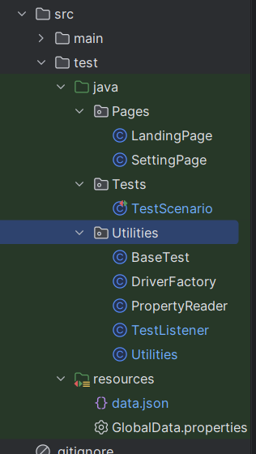
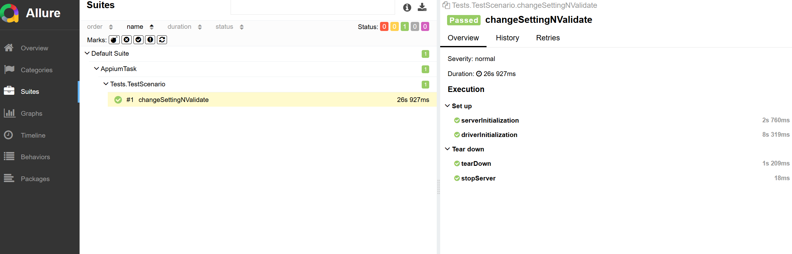

# Weather App UI Automation (Task 2)

**Objective:** Validate the complete user experience of the Weather Application, from the initial setup flow through setting configuration and verifying applied data changes on the home page.

---

## Scenario Description

The test verifies the end-to-end functionality:
1.  Completing the application's **initial setup/onboarding flow**.
2.  Navigating to the **Settings** screen.
3.  **Changing specific settings** (temperature unit, time format).
4.  Returning to the **Home Page** to validate that the new settings are correctly applied and that the displayed weather data is consistent with the configuration.

---

## Implementation Highlights

* **Page Object Model (POM):** Used for test structure, ensuring high maintainability and code readability.
* **Fluent POM:** Implemented a fluent interface for method chaining, creating highly readable, sequential, and descriptive test steps.
* **Driver Management:** Utilized a **DriverFactory/Singleton Pattern** to ensure only a single, thread-safe Appium driver instance is used across the test suite.
* **Externalized Configuration:** Utilized a **Properties File** to manage dynamic configuration parameters (Appium connection, test data) for easy maintenance.
* **Dynamic Pop-up Handling:** Successfully managed a challenging **semi-random pop-up message** by capturing its locator and implementing explicit waits and robust exception handling to prevent test disruption and ensure scenario completion.

---

## Prerequisites

1.  **Android Environment:** A running Android Emulator or Physical Device must be connected and ready for testing.
    * *Verification:* Ensure output shows `device` (not `offline` or `unauthorized`).
        ```bash
        adb devices
        ```
2.  **Appium Server:** Appium is installed and running locally. Connection details are defined in `GlobalData.properties` and can be changed there.

---

## Setup and Execution

### Project Setup
1.  **Install dependencies and build the project:**

    ```bash
    mvn clean install
    ```

### Execution
2.  **Run the tests:** (Uses the default TestNG XML configuration)

    ```bash
    mvn test
    ```

### Reporting
3.  **View Allure Reports:**

    ```bash
    allure serve allure-results
    ```

---

## Project Artifacts

* **Project Structure**  
      
* **Allure Report**  
    